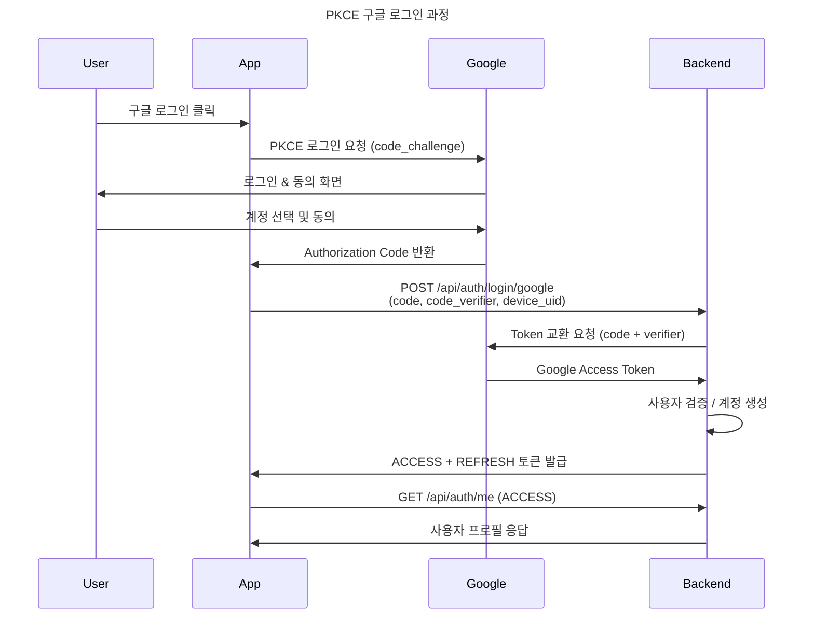

# Diagram

```mermaid
sequenceDiagram
    title PKCE 구글 로그인 과정
    participant User
    participant App
    participant Google
    participant Backend

    User->>App: 구글 로그인 클릭
    App->>Google: PKCE 로그인 요청 (code_challenge)
    Google->>User: 로그인 & 동의 화면
    User->>Google: 계정 선택 및 동의
    Google->>App: Authorization Code 반환

    App->>Backend: POST /api/auth/login/google<br/>(code, code_verifier, device_uid)
    Backend->>Google: Token 교환 요청 (code + verifier)
    Google->>Backend: Google Access Token

    Backend->>Backend: 사용자 검증 / 계정 생성
    Backend->>App: ACCESS + REFRESH 토큰 발급

    App->>Backend: GET /api/auth/me (ACCESS)
    Backend->>App: 사용자 프로필 응답
```

# Notes

* 로그인 성공 후 발급된 토큰의 만료 처리 흐름은 [토큰 갱신](./token-refresh.md) 참고.
* 앱 재시작 시 토큰 기반 인증 복원 흐름은 [세션 복원](./session-restore.md) 참고.
