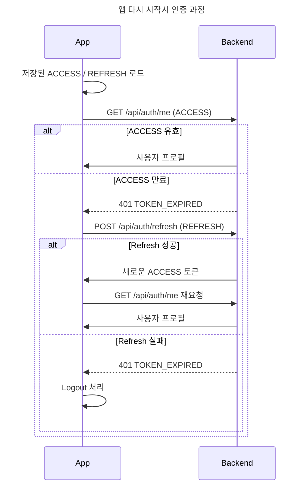

# Diagram

```mermaid
sequenceDiagram
    title 앱 다시 시작시 인증 과정
    participant App
    participant Backend

    App->>App: 저장된 ACCESS / REFRESH 로드
    App->>Backend: GET /api/auth/me (ACCESS)

    alt ACCESS 유효
        Backend->>App: 사용자 프로필
    else ACCESS 만료
        Backend-->>App: 401 TOKEN_EXPIRED
        App->>Backend: POST /api/auth/refresh (REFRESH)

        alt Refresh 성공
            Backend->>App: 새로운 ACCESS 토큰
            App->>Backend: GET /api/auth/me 재요청
            Backend->>App: 사용자 프로필
        else Refresh 실패
            Backend-->>App: 401 TOKEN_EXPIRED
            App->>App: Logout 처리
        end
    end
```

# Notes

* 런타임 중 토큰 만료 처리(요청 큐 포함)는 [토큰 갱신](./token-refresh.md) 참고.
