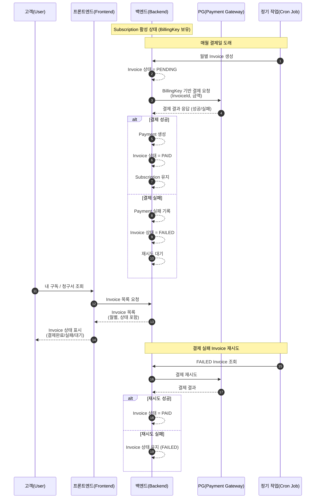

# Diagram

```mermaid
sequenceDiagram
    autonumber
    participant 고객 as 고객(User)
    participant FE as 프론트엔드(Frontend)
    participant BE as 백엔드(Backend)
    participant PG as PG(Payment Gateway)
    participant CRON as 정기 작업(Cron Job)

    %% 최초 구독 완료 상태
    Note over BE: Subscription 활성 상태 (BillingKey 보유)

    %% 월별 Invoice 생성
    Note over CRON,BE: 매월 결제일 도래
    CRON ->> BE: 월별 Invoice 생성
    BE -->> BE: Invoice 상태 = PENDING

    %% 정기결제 시도
    BE ->> PG: BillingKey 기반 결제 요청<br/>(InvoiceId, 금액)
    PG -->> BE: 결제 결과 응답 (성공/실패)

    alt 결제 성공
        BE -->> BE: Payment 생성
        BE -->> BE: Invoice 상태 = PAID
        BE -->> BE: Subscription 유지
    else 결제 실패
        BE -->> BE: Payment 실패 기록
        BE -->> BE: Invoice 상태 = FAILED
        BE -->> BE: 재시도 대기
    end

    %% 고객 조회
    고객 ->> FE: 내 구독 / 청구서 조회
    FE ->> BE: Invoice 목록 요청
    BE -->> FE: Invoice 목록<br/>(월별, 상태 포함)
    FE -->> 고객: Invoice 상태 표시<br/>(결제완료/실패/대기)

    %% 재시도 로직
    Note over CRON,BE: 결제 실패 Invoice 재시도
    CRON ->> BE: FAILED Invoice 조회
    BE ->> PG: 결제 재시도
    PG -->> BE: 결제 결과

    alt 재시도 성공
        BE -->> BE: Invoice 상태 = PAID
    else 재시도 실패
        BE -->> BE: Invoice 상태 유지 (FAILED)
    end
```

# Notes

* Invoice 상태 전이: `PENDING` → `PAID`(성공) / `FAILED`(실패, Cron 재시도 대상).
* BillingKey가 발급되는 최초 구독 결제 흐름은 [구독 상품 결제](./subscription-checkout.md) 참고.
