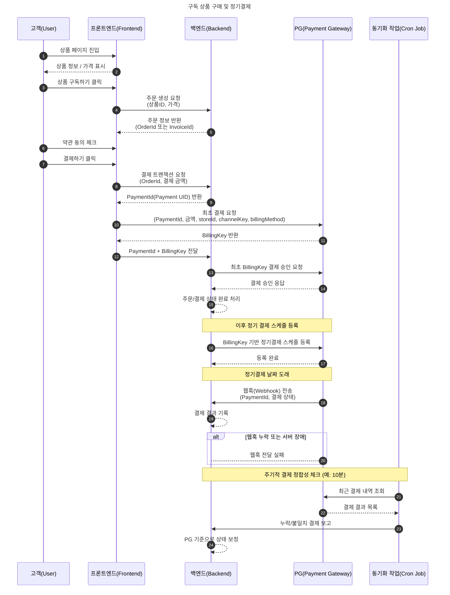

# Diagram

```mermaid
sequenceDiagram
    title 구독 상품 구매 및 정기결제
    autonumber
    participant 고객 as 고객(User)
    participant FE as 프론트엔드(Frontend)
    participant BE as 백엔드(Backend)
    participant PG as PG(Payment Gateway)
    participant CRON as 동기화 작업(Cron Job)

    %% 상품 → 주문 단계
    고객 ->> FE: 상품 페이지 진입
    FE -->> 고객: 상품 정보 / 가격 표시

    고객 ->> FE: 상품 구독하기 클릭
    FE ->> BE: 주문 생성 요청<br/>(상품ID, 가격)
    BE -->> FE: 주문 정보 반환<br/>(OrderId 또는 InvoiceId)

    고객 ->> FE: 약관 동의 체크
    고객 ->> FE: 결제하기 클릭

    %% 결제 준비 단계
    FE ->> BE: 결제 트랜잭션 요청<br/>(OrderId, 결제 금액)
    BE -->> FE: PaymentId(Payment UID) 반환

    %% PG 결제 및 BillingKey 발급
    FE ->> PG: 최초 결제 요청<br/>(PaymentId, 금액, storeId, channelKey, billingMethod)
    PG -->> FE: BillingKey 반환

    FE ->> BE: PaymentId + BillingKey 전달
    BE ->> PG: 최초 BillingKey 결제 승인 요청
    PG -->> BE: 결제 승인 응답
    BE -->> BE: 주문/결제 상태 완료 처리

    %% 정기결제 등록
    Note over BE,PG: 이후 정기 결제 스케줄 등록
    BE ->> PG: BillingKey 기반 정기결제 스케줄 등록
    PG -->> BE: 등록 완료

    %% 정기결제 실행
    Note over PG,BE: 정기결제 날짜 도래
    PG ->> BE: 웹훅(Webhook) 전송<br/>(PaymentId, 결제 상태)
    BE -->> BE: 결제 결과 기록

    %% 예외 처리
    alt 웹훅 누락 또는 서버 장애
        PG --> BE: 웹훅 전달 실패
    end

    %% 보정 로직
    Note over CRON,BE: 주기적 결제 정합성 체크 (예: 10분)
    CRON ->> PG: 최근 결제 내역 조회
    PG -->> CRON: 결제 결과 목록
    CRON ->> BE: 누락/불일치 결제 보고
    BE -->> BE: PG 기준으로 상태 보정
```

# Notes

* 구독 활성화 이후의 월별 청구 흐름은 [Invoice 발행](./invoice-billing.md) 참고.
* 결제 관련 화면 진입 경로는 [화면 흐름도](/screens/screen-flow.md) 참고.
