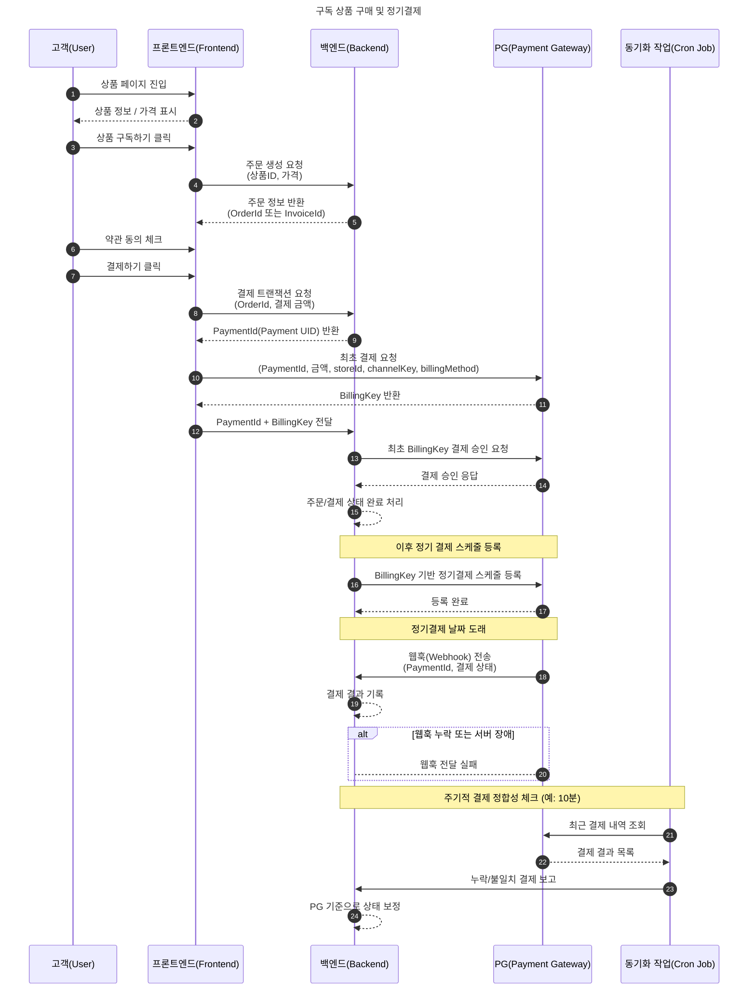
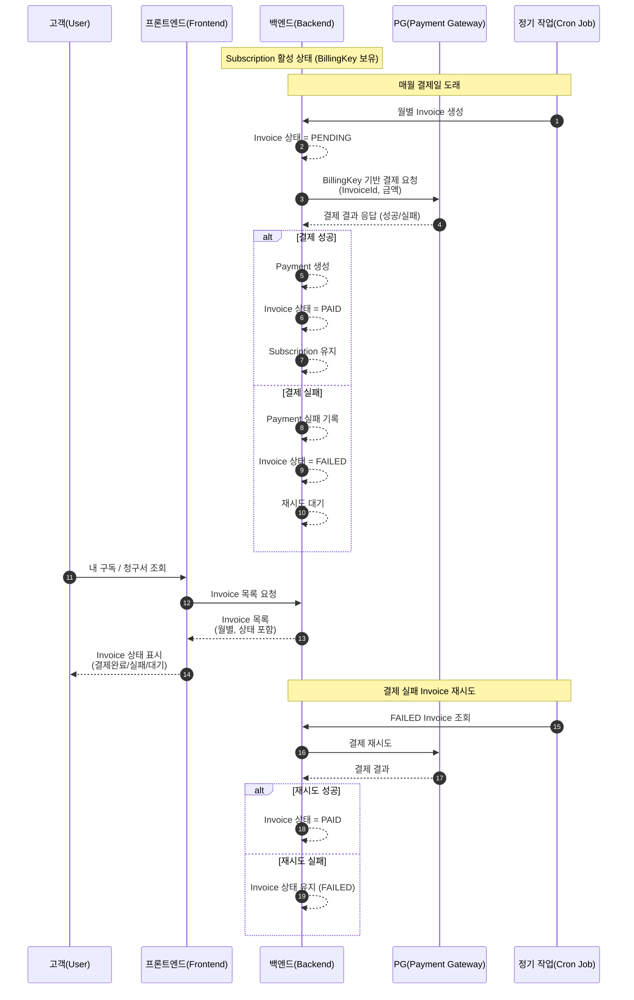

## 구독 상품 결제

```mermaid
sequenceDiagram
    title 구독 상품 구매 및 정기결제
    autonumber
    participant 고객 as 고객(User)
    participant FE as 프론트엔드(Frontend)
    participant BE as 백엔드(Backend)
    participant PG as PG(Payment Gateway)
    participant CRON as 동기화 작업(Cron Job)

    %% 상품 → 주문 단계
    고객 ->> FE: 상품 페이지 진입
    FE -->> 고객: 상품 정보 / 가격 표시

    고객 ->> FE: 상품 구독하기 클릭
    FE ->> BE: 주문 생성 요청<br/>(상품ID, 가격)
    BE -->> FE: 주문 정보 반환<br/>(OrderId 또는 InvoiceId)

    고객 ->> FE: 약관 동의 체크
    고객 ->> FE: 결제하기 클릭

    %% 결제 준비 단계
    FE ->> BE: 결제 트랜잭션 요청<br/>(OrderId, 결제 금액)
    BE -->> FE: PaymentId(Payment UID) 반환

    %% PG 결제 및 BillingKey 발급
    FE ->> PG: 최초 결제 요청<br/>(PaymentId, 금액, storeId, channelKey, billingMethod)
    PG -->> FE: BillingKey 반환

    FE ->> BE: PaymentId + BillingKey 전달
    BE ->> PG: 최초 BillingKey 결제 승인 요청
    PG -->> BE: 결제 승인 응답
    BE -->> BE: 주문/결제 상태 완료 처리

    %% 정기결제 등록
    Note over BE,PG: 이후 정기 결제 스케줄 등록
    BE ->> PG: BillingKey 기반 정기결제 스케줄 등록
    PG -->> BE: 등록 완료

    %% 정기결제 실행
    Note over PG,BE: 정기결제 날짜 도래
    PG ->> BE: 웹훅(Webhook) 전송<br/>(PaymentId, 결제 상태)
    BE -->> BE: 결제 결과 기록

    %% 예외 처리
    alt 웹훅 누락 또는 서버 장애
        PG --> BE: 웹훅 전달 실패
    end

    %% 보정 로직
    Note over CRON,BE: 주기적 결제 정합성 체크 (예: 10분)
    CRON ->> PG: 최근 결제 내역 조회
    PG -->> CRON: 결제 결과 목록
    CRON ->> BE: 누락/불일치 결제 보고
    BE -->> BE: PG 기준으로 상태 보정

```
---
## Invoice 발행

```mermaid
sequenceDiagram
    autonumber
    participant 고객 as 고객(User)
    participant FE as 프론트엔드(Frontend)
    participant BE as 백엔드(Backend)
    participant PG as PG(Payment Gateway)
    participant CRON as 정기 작업(Cron Job)

    %% 최초 구독 완료 상태
    Note over BE: Subscription 활성 상태 (BillingKey 보유)

    %% 월별 Invoice 생성
    Note over CRON,BE: 매월 결제일 도래
    CRON ->> BE: 월별 Invoice 생성
    BE -->> BE: Invoice 상태 = PENDING

    %% 정기결제 시도
    BE ->> PG: BillingKey 기반 결제 요청<br/>(InvoiceId, 금액)
    PG -->> BE: 결제 결과 응답 (성공/실패)

    alt 결제 성공
        BE -->> BE: Payment 생성
        BE -->> BE: Invoice 상태 = PAID
        BE -->> BE: Subscription 유지
    else 결제 실패
        BE -->> BE: Payment 실패 기록
        BE -->> BE: Invoice 상태 = FAILED
        BE -->> BE: 재시도 대기
    end

    %% 고객 조회
    고객 ->> FE: 내 구독 / 청구서 조회
    FE ->> BE: Invoice 목록 요청
    BE -->> FE: Invoice 목록<br/>(월별, 상태 포함)
    FE -->> 고객: Invoice 상태 표시<br/>(결제완료/실패/대기)

    %% 재시도 로직
    Note over CRON,BE: 결제 실패 Invoice 재시도
    CRON ->> BE: FAILED Invoice 조회
    BE ->> PG: 결제 재시도
    PG -->> BE: 결제 결과

    alt 재시도 성공
        BE -->> BE: Invoice 상태 = PAID
    else 재시도 실패
        BE -->> BE: Invoice 상태 유지 (FAILED)
    end

```