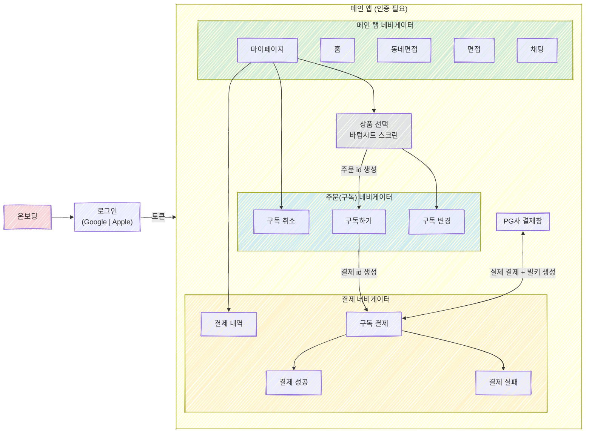

# Diagram

```mermaid
---
config:
  look: handDrawn
---
flowchart LR
 subgraph Auth["로그인
 (Google | Apple)"]
  end

 subgraph Tabs["메인 탭 네비게이터"]
        Home["홈"]
        Local["동네면접"]
        Interview["면접"]
        Chat["채팅"]
        MyPage["마이페이지"]
  end
 subgraph Payment["결제 네비게이터"]
        PayHistory["결제 내역"]
        SubPay["구독 결제"]
        PaySuccess["결제 성공"]
        PayFail["결제 실패"]
  end
 subgraph Subscribe["주문(구독) 네비게이터"]
        Sub["구독하기"]
        SubChange["구독 변경"]
        SubCancel["구독 취소"]
  end
 subgraph PG["PG사 결제창"]
  end
 subgraph MainApp["메인 앱 (인증 필요)"]
    direction TB
        Tabs
        Payment
        Subscribe
        PG
        Product["상품 선택<br>바텀시트 스크린"]
  end
    MyPage --> Product & PayHistory & SubCancel
    Product -- 주문 id 생성 --> Sub
    Product --> SubChange
    Sub -- 결제 id 생성 --> SubPay
    SubPay --> PaySuccess & PayFail
    PG -- 실제 결제 + 빌키 생성 <--> SubPay
    Landing["온보딩"] --> Auth
    Auth -- 토큰 --> MainApp

    style Tabs fill:#d4edda
    style Payment fill:#fff3cd
    style Subscribe fill:#d1ecf1
    style Product fill:#e2e3e5
    style Landing fill:#f8d7da
```

# Notes

* 로그인 → 토큰 발급 상세 흐름은 [PKCE 구글 로그인](/auth/google-login-pkce.md) 참고.
* 구독 결제 상세 흐름은 [구독 상품 결제](/payment/subscription-checkout.md) 참고.
